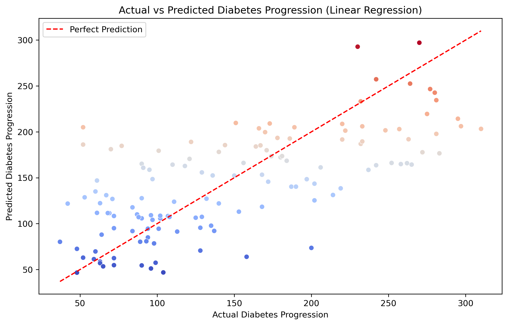
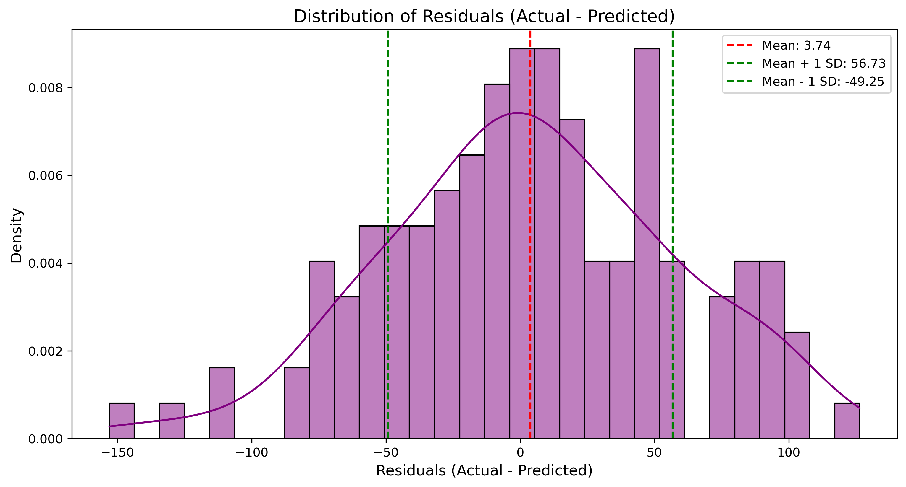

# Diabetes Progression Prediction using Linear Regression

Welcome to the **Diabetes Progression Prediction** tutorial! This project demonstrates how to apply **Linear Regression** to predict the progression of diabetes using medical variables. The dataset is sourced from **sklearn.datasets**, and the goal is to create a predictive model, evaluate its performance, and visualize the results.

## Table of Contents

- [Project Overview](#project-overview)
- [Dataset](#dataset)
- [Installation Instructions](#installation-instructions)
- [Usage](#usage)
- [Project Structure](#project-structure)
- [Model Evaluation](#model-evaluation)
- [Visualizations](#visualizations)
- [Conclusion](#conclusion)
- [License](#license)

## Project Overview

In this tutorial, we will walk through the process of building a **Linear Regression** model to predict diabetes progression. The dataset contains medical features such as age, BMI, blood pressure, and cholesterol levels, which are used to predict the progression of diabetes over time. The primary objective is to train the model, evaluate its performance, and generate insightful visualizations.

## Dataset

The dataset used in this project is the **Diabetes Dataset** from **sklearn.datasets**.

- **Features**: 10 medical variables including age, sex, BMI, blood pressure, and cholesterol levels.
- **Target**: Diabetes progression (numeric value, indicating the disease progression).

## Installation Instructions

To run this project locally, you'll need to set up your environment by installing the required dependencies.

1. Clone the repository to your local machine:
   ```bash
   git clone https://github.com/yourusername/diabetes-prediction-lr.git
   ```

2. Navigate to the project directory:
   ```bash
   cd diabetes-prediction-lr
   ```

3. Install the necessary Python libraries:
   ```bash
   pip install -r requirements.txt
   ```

   This will install the following libraries:
   - pandas
   - numpy
   - sklearn
   - matplotlib
   - seaborn

## Usage

After setting up your environment, you can execute the Python script to train the model, evaluate its performance, and generate visualizations.

1. Run the script:
   ```bash
   python diabetes_lr.py
   ```

   The script will output the model's evaluation metrics, including **Mean Squared Error (MSE)** and **R-squared (R²)**, and display the plots for **Actual vs Predicted Diabetes Progression** and **Residuals Distribution**.

## Project Structure

The project directory contains the following files:

- **diabetes_lr.py**: Python script for loading the dataset, training the Linear Regression model, performing model evaluation, and generating visualizations.
- **requirements.txt**: File listing all required dependencies.
- **actual_vs_predicted_diabetes_lr.png**: Scatter plot of actual vs predicted diabetes progression.
- **residuals_distribution_diabetes.png**: Distribution plot of residuals showing errors in predictions.

## Model Evaluation

The model's performance is evaluated using the following metrics:

1. **Mean Squared Error (MSE)**: Measures the average squared difference between actual and predicted values. Lower values are better.
2. **R-squared (R²)**: Represents the proportion of variance explained by the model. Higher values indicate a better fit.

### Example Output:

```
Mean Squared Error (MSE): 2821.75
R-squared (R²): 0.477
```

## Visualizations

1. **Actual vs Predicted Diabetes Progression**:
   - This scatter plot visualizes the actual vs predicted values. The plot includes a **red dashed line** representing the perfect prediction (where actual = predicted).
   - **Color coding**: The points are color-coded according to the predicted values to help distinguish between higher and lower progression levels.

   

2. **Residuals Distribution**:
   - This histogram shows the distribution of residuals (the difference between actual and predicted values).
   - The plot includes vertical lines indicating the **mean** and **one standard deviation** from the mean, giving insights into model errors and how well the model fits the data.

   

## Conclusion

This project provides a simple yet powerful demonstration of **Linear Regression** for predicting diabetes progression. While the model's performance is decent, it shows potential for improvement. Further steps could include:
- Trying more advanced regression models (e.g., Decision Trees, Random Forest, or Gradient Boosting).
- Tuning hyperparameters to improve model accuracy.
- Analyzing feature importance and refining the feature set.

Feel free to explore and adapt this code for your own projects or tutorials. Contributions are welcome!

## License

This project is licensed under the MIT License - see the [LICENSE](LICENSE) file for details.

This **README** provides a clear and detailed explanation of the project, making it accessible for both beginners and more advanced users who wish to understand and experiment with the model. It includes an overview, step-by-step instructions, and visualizations to enhance the tutorial's value.
